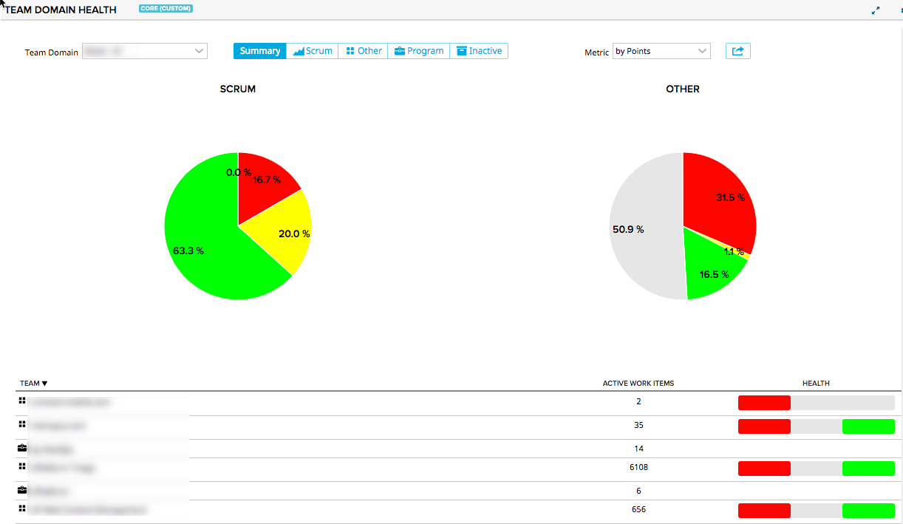
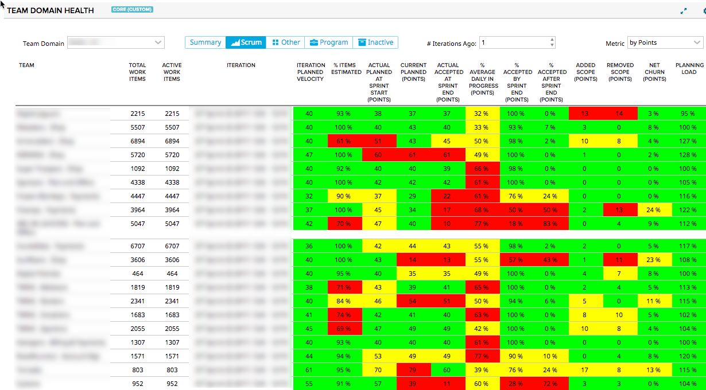

# Team Domain Health

## Summary/Description

For all the projects in the selected "Domain" (or project scope if no domain field is configured), this app will classify the teams according to the following criteria:

##### Scrum
* Leaf node teams (Team has no open children teams)
* Has at least 1 active work item
* Iterations exist for the team
* Iteration has a planned velocity set
* At least 1 story is scheduled into the iteration

##### Other
* Any leaf node teams with active work items that do not meet the criteria for a scrum team

##### Program
* Teams are at the program level and have open child teams.

##### Inactive
* No work items have been modified within the active days range (Active Days is set in the app settings)

The app will show the following basic health indicators for each classification:

### Summary

Shows a summary of teams based on classification.  The coloring represents the cell colors for the health indicators of each team.  Program level and Inactive teams will not have a summary.  

### Scrum

#### Iteration Planned Velocity
The planned velocity set on the Iteration

#### Actual Planned at Sprint Start
The actual sum of Points (or Count) planned into the iteration.  This number comes from the cumulative flow data from the first day of the iteration.   

#### Current Planned
The sum of Points (or Count) associated with the iteration currently.  This number will be different from the Actual Planned becuase it represents the current number of points associated with the iteration.  If stories were added or removed from the iteration after the first day, this will include those.

#### Actual Accepted
The actual sum of Points (or Count) accepted as of the last day of the iteration.  This number comes from the cumulative flow data from the last day of the iteration.   

#### % Accepted by Sprint End
The % of current points (or count) whose accepted date is before the end of the iteration.  This is calculated using the current the accepted date and the iteration end date.    

#### % Accepted after Sprint End
The % of current points (or count) that were accepted after the end of the iteration.  This is calculated using the current wsapi data associated with the iteration.    

#### % Average Daily In Progress
This is the average of the ratio of points (or count) in an In Progress state versus the total points for each day during the course of the iteration.  This is calculated using Iteration Cumulative Flow Data.

#### Added Scope
This is the sum of points (or count) added each day over the course of the iteration.  Note that the net scope change for the iteration should be represented by subtracting Removed Scope from Added Scope.   This is calculated using Iteration Cumulative Flow Data.  

#### Removed Scope
This is the sum of points (or count) removed each day over the course of the iteration.  Note that the net scope change for the iteration should be represented by subtracting Removed Scope from Added Scope.     This is calculated using Iteration Cumulative Flow Data.

#### Net Churn
Net Churn is the absolute value of the Added Scope - Removed Scope / Actual Planned at Iteration Start

#### Planned Load
Planned Load is the Actual Planned at Sprint Start / Iteration Planned Velocity

## App Settings

##### Project Domain Field
If not using the project scope for the projects to show, select a custom dropdown field on the project.  This will give you the option to show projects grouped by the value of this field.  

##### Thresholds
For most metrics listed above, there is a threshold slider that will determine how to color the cells according to a percentage of the actual planned points or count.  

### Other

#### % Items Estimated
This is the percentage of User Stories in the "Defined" state that have a Plan Estimate > 0.

#### # Defined Stories
This is the number of User Stories in the "Defined" state.

#### Accepted Stories (Points or Count)
The sum of the Plan Estimate of User Stories accepted in the last number of Active days (per the app settings) OR the count of the user stories accepted in the last number of Active Days.  

#### Average Cycle Time
The average cycle time for the user stories accepted in the last number of Active days.  CycleTime is defined as the number of days from when the story last transitioned into or past the In-Progress state to when the user story last transitioned into or past the Accepted state.  

#### Cycle Time CoV
The coefficient of variation of the cycle time (Standard Deviation / Average Cycle Time).

#### Average Work In Progress (Points or Count)
The average number (or sum of plan estimate) of user stories in progress each day over the past number of active days.

#### Work In Progress CoV
 The coefficient of variation of the work in progress (Standard Deviation / Average work in progress).

**NOTE:  This app uses the Lookback API and Performance may be slow if a large number of teams are assigned to the selected domains.**

## Development Notes

### First Load

If you've just downloaded this from github and you want to do development,
you're going to need to have these installed:

 * node.js
 * grunt-cli
 * grunt-init

Since you're getting this from github, we assume you have the command line
version of git also installed.  If not, go get git.

If you have those three installed, just type this in the root directory here
to get set up to develop:

  npm install

### Structure

  * src/javascript:  All the JS files saved here will be compiled into the
  target html file
  * src/style: All of the stylesheets saved here will be compiled into the
  target html file
  * test/fast: Fast jasmine tests go here.  There should also be a helper
  file that is loaded first for creating mocks and doing other shortcuts
  (fastHelper.js) **Tests should be in a file named <something>-spec.js**
  * test/slow: Slow jasmine tests go here.  There should also be a helper
  file that is loaded first for creating mocks and doing other shortcuts
  (slowHelper.js) **Tests should be in a file named <something>-spec.js**
  * templates: This is where templates that are used to create the production
  and debug html files live.  The advantage of using these templates is that
  you can configure the behavior of the html around the JS.
  * config.json: This file contains the configuration settings necessary to
  create the debug and production html files.  
  * package.json: This file lists the dependencies for grunt
  * auth.json: This file should NOT be checked in.  Create this to create a
  debug version of the app, to run the slow test specs and/or to use grunt to
  install the app in your test environment.  It should look like:
    {
        "username":"you@company.com",
        "password":"secret",
        "server": "https://rally1.rallydev.com"
    }

### Usage of the grunt file
####Tasks

##### grunt debug

Use grunt debug to create the debug html file.  You only need to run this when you have added new files to
the src directories.

##### grunt build

Use grunt build to create the production html file.  We still have to copy the html file to a panel to test.

##### grunt test-fast

Use grunt test-fast to run the Jasmine tests in the fast directory.  Typically, the tests in the fast
directory are more pure unit tests and do not need to connect to Rally.

##### grunt test-slow

Use grunt test-slow to run the Jasmine tests in the slow directory.  Typically, the tests in the slow
directory are more like integration tests in that they require connecting to Rally and interacting with
data.

##### grunt deploy

Use grunt deploy to build the deploy file and then install it into a new page/app in Rally.  It will create the page on the Home tab and then add a custom html app to the page.  The page will be named using the "name" key in the config.json file (with an asterisk prepended).

To use this task, you must create an auth.json file that contains the following keys:
{
    "username": "fred@fred.com",
    "password": "fredfredfred",
    "server": "https://us1.rallydev.com"
}

(Use your username and password, of course.)  NOTE: not sure why yet, but this task does not work against the demo environments.  Also, .gitignore is configured so that this file does not get committed.  Do not commit this file with a password in it!

When the first install is complete, the script will add the ObjectIDs of the page and panel to the auth.json file, so that it looks like this:

{
    "username": "fred@fred.com",
    "password": "fredfredfred",
    "server": "https://us1.rallydev.com",
    "pageOid": "52339218186",
    "panelOid": 52339218188
}

On subsequent installs, the script will write to this same page/app. Remove the
pageOid and panelOid lines to install in a new place.  CAUTION:  Currently, error checking is not enabled, so it will fail silently.

##### grunt watch

Run this to watch files (js and css).  When a file is saved, the task will automatically build, run fast tests, and deploy as shown in the deploy section above.

##### grunt --help  

Get a full listing of available targets.
