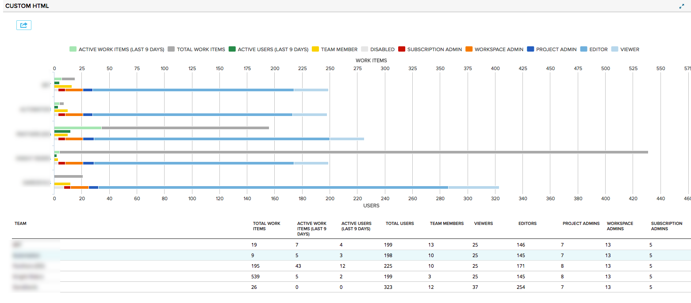

# Team Users View

A view of user permission and work item information (if configured) per project.  

## Summary/Description

This app can show information for either child projects in the currently selected scope, or projects grouped by a custom attribute on the project object (also referred to as "Domain").  This can be setup in the App Settings.  

A project "Domain" may be used for when you would like to see projects grouped together outside of the project hierarchy in Agile Central.  

Work Item Growth chart shows the growth of *all artifacts* over the course of time.  The Work Item growth shows only current artifacts and does not include artifacts that have been deleted or moved into another project since they were created.  The chart uses the "Creation Date" field of the artifact so if an artifact was created in another project and moved to the current project, it *will* be included in the count for the current project.  

#### Metrics

##### Active Work Items
If "Show Work Item Data" is configured, this will show the number of artifacts (Portfolio Items, Stories, Defects, Tasks, etc) in the project updated within the last N days where N is the "Active Days" configuration.  See app settings for more detail on the configuration.  

##### Total Work Items
If "Show Work Item Data" is configured, this will show the total number of artifacts (Portfolio Items, Stories, Defects, Tasks, etc) in the project updated within the last N days where N is the "Active Days" configuration.  See app settings for more detail on the configuration.  

##### Active Users
If "Show Work Item Data" is configured, this will show the total number of unique users that updated artifacts in the last N number of days. N is the "Active Days" configuration.  See app settings for more detail on the configuration.  

##### Team Member
The number of team members for the current project.  

##### Disabled
The number of disabled users that have permissions in the current project.  Note that disabled users cannot access the project, but if they are re-enabled, will have access to the project.  

##### Subscription Admin
The number of Subscription Administrators for the Subscription.

##### Workspace Admin
The number of Workspace Administrators (not including Disabled users) for the current workspace.

##### Project Admin
The number of Project Administrators (not including Disabled users) for the current project.

##### Editor
The number of editors (not including Disabled users) for the current project.  

##### Viewer
The number of Viewers (not including Disabled users) for the current project.  

### App Settings
##### Project Domain Field
If not using the project scope for the projects to show, select a custom dropdown field on the project.  This will give you the option to show projects grouped by the value of this field.   

##### Active Days
If "Show Work Item Data" is selected, this will be applicable to the "Active Work Items" and "Active Users" metrics.  This will determine how many days back from the current point in time a change needs to be made for a work item to be considered "active" or for a user to be considered "active" for the project.  

##### Show Work Item Data
Select true to show work item information.  Work Item Information (Total Work Items, Active Work Items and Active Users) uses the lookback API to gather data.  If running On-Premise or the lookback API is down or causing performance issues, then uncheck this box and the lookback API will not be queried.   

## Development Notes

### First Load

If you've just downloaded this from github and you want to do development,
you're going to need to have these installed:

 * node.js
 * grunt-cli
 * grunt-init

Since you're getting this from github, we assume you have the command line
version of git also installed.  If not, go get git.

If you have those three installed, just type this in the root directory here
to get set up to develop:

  npm install

### Structure

  * src/javascript:  All the JS files saved here will be compiled into the
  target html file
  * src/style: All of the stylesheets saved here will be compiled into the
  target html file
  * test/fast: Fast jasmine tests go here.  There should also be a helper
  file that is loaded first for creating mocks and doing other shortcuts
  (fastHelper.js) **Tests should be in a file named <something>-spec.js**
  * test/slow: Slow jasmine tests go here.  There should also be a helper
  file that is loaded first for creating mocks and doing other shortcuts
  (slowHelper.js) **Tests should be in a file named <something>-spec.js**
  * templates: This is where templates that are used to create the production
  and debug html files live.  The advantage of using these templates is that
  you can configure the behavior of the html around the JS.
  * config.json: This file contains the configuration settings necessary to
  create the debug and production html files.  
  * package.json: This file lists the dependencies for grunt
  * auth.json: This file should NOT be checked in.  Create this to create a
  debug version of the app, to run the slow test specs and/or to use grunt to
  install the app in your test environment.  It should look like:
    {
        "username":"you@company.com",
        "password":"secret",
        "server": "https://rally1.rallydev.com"
    }

### Usage of the grunt file
####Tasks

##### grunt debug

Use grunt debug to create the debug html file.  You only need to run this when you have added new files to
the src directories.

##### grunt build

Use grunt build to create the production html file.  We still have to copy the html file to a panel to test.

##### grunt test-fast

Use grunt test-fast to run the Jasmine tests in the fast directory.  Typically, the tests in the fast
directory are more pure unit tests and do not need to connect to Rally.

##### grunt test-slow

Use grunt test-slow to run the Jasmine tests in the slow directory.  Typically, the tests in the slow
directory are more like integration tests in that they require connecting to Rally and interacting with
data.

##### grunt deploy

Use grunt deploy to build the deploy file and then install it into a new page/app in Rally.  It will create the page on the Home tab and then add a custom html app to the page.  The page will be named using the "name" key in the config.json file (with an asterisk prepended).

To use this task, you must create an auth.json file that contains the following keys:
{
    "username": "fred@fred.com",
    "password": "fredfredfred",
    "server": "https://us1.rallydev.com"
}

(Use your username and password, of course.)  NOTE: not sure why yet, but this task does not work against the demo environments.  Also, .gitignore is configured so that this file does not get committed.  Do not commit this file with a password in it!

When the first install is complete, the script will add the ObjectIDs of the page and panel to the auth.json file, so that it looks like this:

{
    "username": "fred@fred.com",
    "password": "fredfredfred",
    "server": "https://us1.rallydev.com",
    "pageOid": "52339218186",
    "panelOid": 52339218188
}

On subsequent installs, the script will write to this same page/app. Remove the
pageOid and panelOid lines to install in a new place.  CAUTION:  Currently, error checking is not enabled, so it will fail silently.

##### grunt watch

Run this to watch files (js and css).  When a file is saved, the task will automatically build, run fast tests, and deploy as shown in the deploy section above.

##### grunt --help  

Get a full listing of available targets.
